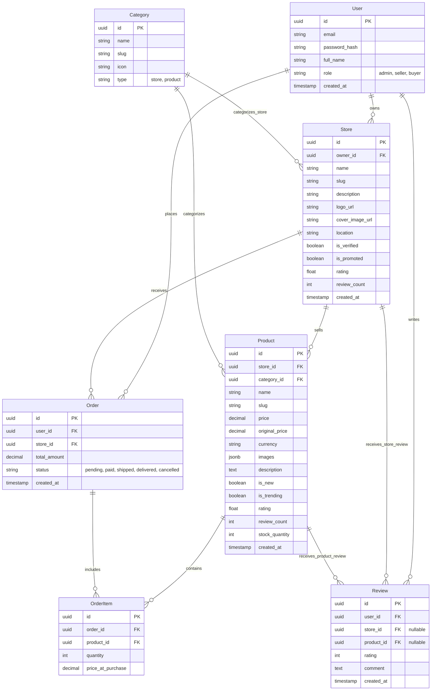

# Database Schema Proposal

This document outlines the proposed database schema for the LupaShop Marketplace backend. It is designed to support the current frontend features, including stores, products, categories, reviews, and user authentication.

## Entity Relationship Diagram (ERD)

## Table Definitions

### Users
Stores user account information for buyers, sellers, and admins.
- `role`: Determines permissions (e.g., only sellers can create stores).

### Stores
Represents a shop within the marketplace.
- `owner_id`: Links the store to a specific User (seller).
- `is_verified`: For the "Verified" badge.
- `is_promoted`: For the "Promoted" widget.

### Categories
Hierarchical or flat organization for stores and products.
- `type`: Distinguishes between store categories (e.g., "Electronics Store") and product categories if they differ.

### Products
Items listed for sale by a store.
- `images`: Stored as a JSON array of URLs.
- `is_trending`: Flag for the "Trending" view (could also be calculated dynamically based on sales/views).

### Orders & OrderItems
Transactional data.
- `Order`: The high-level transaction.
- `OrderItem`: Specific products within an order.

### Reviews
Feedback system.
- Can be linked to either a `Store` or a `Product`.

## Considerations
- **Search**: For high-performance search (products, stores), consider syncing data to a search engine like Elasticsearch or Meilisearch.
- **Analytics**: Store views, clicks, and sales data should likely be stored in a separate analytics table or service to avoid bloating the main transactional DB.
